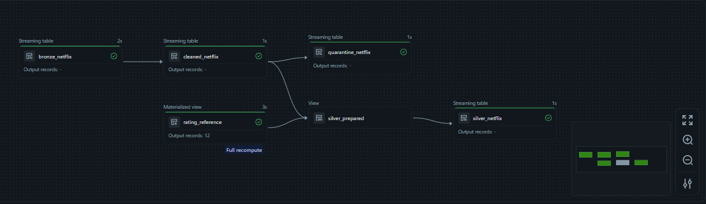
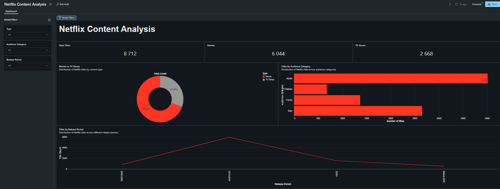
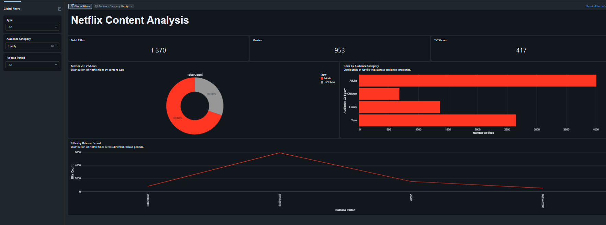
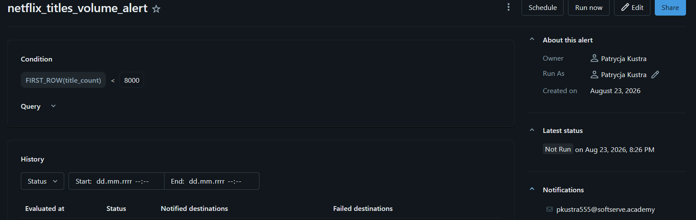
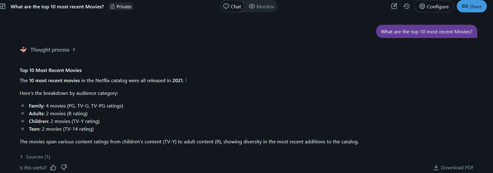
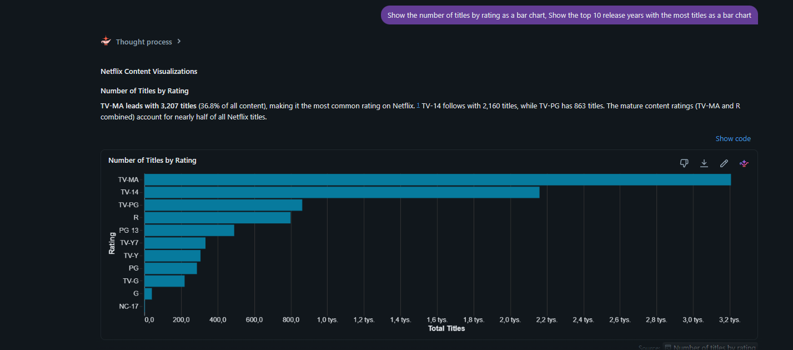
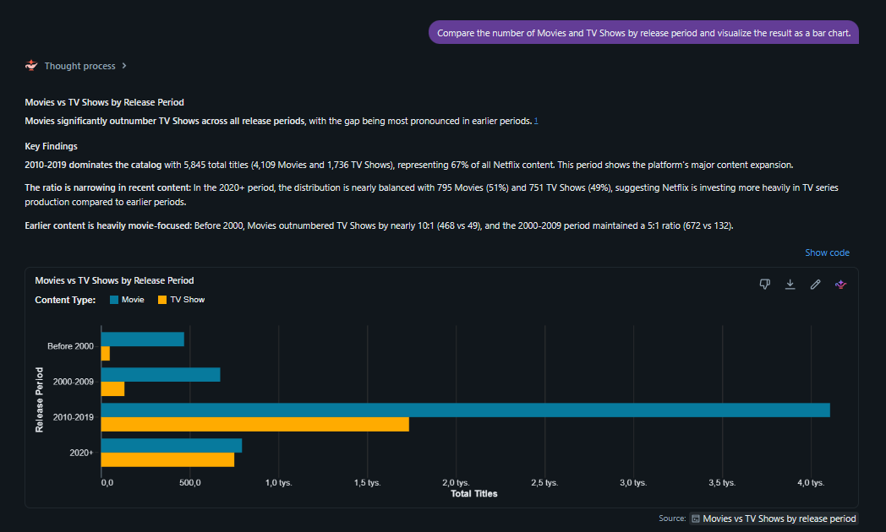

# lab5_declarative_pipeline

The goal of Lab 5 was to build a data pipeline using Lakeflow
Declarative Pipelines and compare this approach with the classic Spark
pipeline implemented in Lab 4.

The solution uses the Netflix dataset and follows a Bronze--Silver
processing flow. The project is also configured as a Databricks
Declarative Automation Bundle, which allows the pipeline configuration
to be parameterized for different environments.

##Input data preparation 
The project includes helper notebooks in folder helpers for preparing and simulating incremental data ingestion:

- `00_setup` prepares the required directories and data locations.
- `01_prepare_stream_batches` splits the source Netflix dataset into batches used to simulate incremental data arrival.
- `01a_load_batch` copies a selected batch into the landing directory, simulating the arrival of new source data.

Description of batches: 
- Batch 1 contains the initial dataset.
- Batch 2 is used to simulate changes to existing data and duplicate records.
- Batch 3 introduces the additional imdb_rating column to test schema evolution.

The prepared batches are copied one by one into the landing directory,
which makes it possible to observe how the pipeline behaves when new
data arrives.

## Bronze layer

The Bronze layer represents the raw ingestion stage of the pipeline.

The streaming source is based on files arriving in the landing
directory. The purpose of this layer is to ingest incoming data before
applying the business transformations required in the Silver layer.

The pipeline therefore separates data ingestion from later cleaning,
validation, enrichment, and historical processing.

## Silver processing

The Silver processing stage cleans and prepares the Netflix data for
further use.

The pipeline contains multiple datasets representing separate processing
responsibilities. Instead of manually defining the execution order,
dependencies are created through references between datasets. Lakeflow
analyzes these dependencies and builds the execution graph
automatically.

The pipeline contains, among others:

- `bronze_netflix`
- `cleaned_netflix`
- `quarantine_netflix`
- `rating_reference`
- `silver_prepared`
- `silver_netflix`

This structure also makes the data flow visible directly in the pipeline
UI.

##Data quality and quarantine

Data quality rules are implemented using expectations.
he validation rules include checks such as:

- `show_id` must not be null,
- `title` must not be null,
- `type` must contain an expected value,
- `release_year` must be within the expected range.

Invalid records can be separated into the `quarantine_netflix` dataset,
allowing incorrect data to be inspected without mixing it with the valid
processing path. (`quarantine_netflix` was created to follow best practises)

## Batch / reference data
In addition to the streaming source, the pipeline uses reference data
through `rating_reference`.

This demonstrates that a declarative pipeline can combine streaming
processing with non-streaming reference data. The reference dataset
participates in the dependency graph and is used during preparation of
the Silver data.

## Safe reload
Safe reload was tested by running the pipeline again without
adding new source data.

After the second execution, the number of records did not increase, so the pipeline didn't add another copy. 

## Data lineage and monitoring 

[view from the databricks free account]

##Classic Spark pipelines vs declarative pipelines 

In Lab 4, using classic Spark, I was responsible for defining how the pipeline should execute. I created separate processing steps and controlled their execution order. In Lab 5, I mainly define the datasets and their relationships. Lakeflow analyzes and understands these dependencies and automatically creates the execution graph, order. 

In both labs, I implemented the SCD Type 2. In lab4, I had to manually implement change detection and the logic for closing old records and inserting new versions. In Lab5, I declare the
SCD behavior and Lakeflow manages the historical versions automatically. 

In Lab4, data quality rules were implemented as normal Spark transformations. In Lab 5, I defined expectations. Data quality became part of the pipeline. Also the pipeline UI automatically shows the data flow, execution status. In lab4 I had to monitor the individual notebooks, jobs and tables to understand more of the processing flow.

Declarative pipelines provide more operational simplicity because Lakeflow handles more of the orchestration and pipeline management automatically such as dataset dependencies, execution order, monitor, SCD Type 2 (less code is needed and the pipeline is easier to maintain). Classic Spark pipelines require more manual work, more code, but they provide more flexibility, control. It is easier to introduce custom processing logic. The cost mainly depends on the compute resources used and how the pipeline is execute. Lakeflow can perform incremental processing, processing new/changed data instead of recomputing the entire dataset every time, but frequent pipeline updates, huge number of transformations can increase the cost. 

# LAB6: Gold Layer, AI/BI and Governance
## Overview
Extension of the Netflix data pipeline with a Gold layer, analytical dashboard,
alerting, governance mechanisms and AI/BI Genie.

## Gold Layer
- Aggregated datasets
- Dimension tables
- Fact table
- Basic star schema

## AI/BI Dashboard
- Total titles, Movies and TV Shows KPIs
- Content type distribution
- Audience category analysis
- Release period analysis
- Interactive filters

## Business Questions & Insights

#### How is the catalog distributed between Movies and TV Shows?
The content type distribution shows whether the catalog is dominated by Movies
or maintains a balance between Movies and TV Shows.

**Business value:** Supports content portfolio planning and helps identify
potential gaps in the catalog.

#### Which audience segments dominate the catalog?
Audience category analysis shows which viewer groups are most strongly
represented in the available content.

**Business value:** Helps evaluate whether the catalog is diversified across
different target audiences.

#### How modern is the content catalog?
Release period analysis shows how much of the catalog consists of recent
productions compared with older content.

**Business value:** Helps identify whether the catalog is focused on recent
content or relies heavily on legacy titles.

## Alerting
An SQL alert was configured to detect a significant drop in title volume
and send an email notification.

## Governance
Unity Catalog governance mechanisms were demonstrated using:
- GRANT permissions
- Row-Level Security (RLS)
- Column-Level Security (CLS)

Dedicated test data was used to demonstrate the security policies without
affecting the production Gold tables (everything in `/governance/07_governance` )

## AI/BI Genie
A Genie Agent was configured for natural-language analysis of the Gold layer.
It can answer analytical questions and generate visualizations based on the data.

